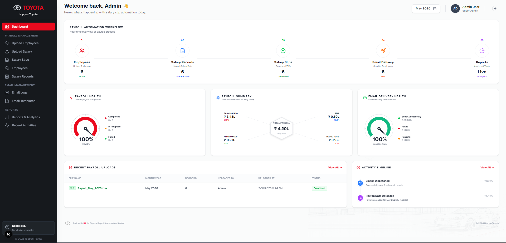
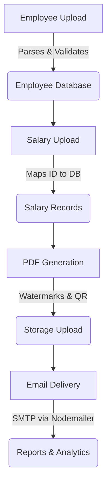

# Toyota Salary Slip Automation System



---

## 📖 Project Overview

The **Toyota Salary Slip Automation System** is a robust, full-stack web application designed to streamline the payroll administration process. Processing monthly salaries and distributing individual salary slips manually is incredibly time-consuming, prone to human error, and poses a risk to data security.

This system solves these issues by automating the entire end-to-end workflow—from importing bulk employee and payroll data to automatically generating watermarked, secure PDF salary slips and distributing them via email. This allows HR and Administrative teams to drastically reduce their manual workload, maintain compliance, and gain immediate insights through the analytics dashboard.

---

## ✨ Key Features

- [x] **Comprehensive Dashboard:** Real-time metrics on employees, salary distributions, and email delivery statuses.
- [x] **Employee Management:** Full CRUD operations for managing the employee directory.
- [x] **Employee Bulk Upload:** Import employee records instantly via CSV/XLSX.
- [x] **Salary Data Upload:** Secure bulk upload of monthly payroll data (Basic, HRA, Allowances, Deductions).
- [x] **Salary Records Management:** View, edit, and validate all processed salary records.
- [x] **Salary Slip Generation:** Automated calculation of Net Salary and generation of individual slip records.
- [x] **PDF Generation:** On-the-fly generation of highly professional, print-ready PDF salary slips.
- [x] **PDF Watermark & Security:** Custom Toyota branding and watermarks applied to PDFs.
- [x] **PDF Password Protection:** Automatically encrypts salary slip PDFs using the employee's Date of Birth (DDMMYYYY) as the password for enhanced security.
- [x] **QR Verification:** Embedded QR codes within the PDF for authenticity and tracking.
- [x] **Email Templates:** Custom, dynamic email templates with placeholders (`{{employee_name}}`, `{{net_salary}}`, etc.).
- [x] **SMTP Email Delivery:** Automated bulk dispatch of salary slips directly to employee inboxes.
- [x] **Email Delivery Logs:** Track success, failures, and delivery timestamps for all emails.
- [x] **Reports & Analytics:** Drill-down views and summaries of payroll data without exposing sensitive tax info.
- [x] **Responsive Design:** A flawless Desktop-Table / Mobile-Card layout strategy ensures usability across all devices.
- [x] **Supabase Integration:** Secure database, storage, and API layer.

---

## 🛠️ Tech Stack

**Frontend:**
- **Framework:** [Next.js 15](https://nextjs.org/) (App Router)
- **Language:** TypeScript
- **Styling:** Tailwind CSS
- **Icons:** Lucide React, React Icons
- **Charts:** Recharts

**Backend:**
- **Architecture:** Next.js Server Actions & Service Layer
- **Validation:** Zod

**Database & Storage:**
- **Database:** Supabase (PostgreSQL)
- **Storage:** Supabase Storage Bucket

**Services & Utilities:**
- **Email:** Nodemailer & Gmail SMTP
- **PDF Generation:** pdf-lib

---

## 📸 Project Screenshots

### Dashboard


### Upload Employees


### Upload Salary


### Salary Records


### Salary Slips & PDF Preview


### Email Templates


### Reports & Analytics


---

## 🚀 Installation

Follow these steps to set up the project locally:

1. **Clone the repository**
   ```bash
   git clone https://github.com/your-username/toyota-salary-slip-system.git
   cd toyota-salary-slip-system
   ```

2. **Install dependencies**
   ```bash
   npm install
   ```

3. **Configure environment variables**
   Copy the example environment file and fill in your credentials.
   ```bash
   cp .env.example .env.local
   ```
   *(See the Environment Variables section for required keys).*

4. **Run the development server**
   ```bash
   npm run dev
   ```
   Open [http://localhost:3000](http://localhost:3000) in your browser to see the application.

---

## 🔐 Environment Variables

Ensure your `.env.local` file contains the following variables:

```env
# Supabase Configuration
NEXT_PUBLIC_SUPABASE_URL=your_supabase_project_url
NEXT_PUBLIC_SUPABASE_ANON_KEY=your_supabase_anon_key
SUPABASE_SERVICE_ROLE_KEY=your_supabase_service_role_key

# SMTP Configuration for Email Delivery
SMTP_HOST=smtp.gmail.com
SMTP_PORT=465
SMTP_USER=your_email@gmail.com
SMTP_PASS=your_app_password
EMAIL_FROM="Toyota HR <your_email@gmail.com>"
```

---

## 🗄️ Database Setup

The project relies on Supabase for the database and storage.

1. **Create a Supabase Project:** Sign up at [Supabase](https://supabase.com/) and create a new project.
2. **Run Schema:** Execute the provided `supabase/schema.sql` script in the Supabase SQL Editor. This will create the required tables (`employees`, `salary_records`, `email_logs`, `email_templates`) and set up row-level security.
3. **Configure Storage Bucket:** Create a new public storage bucket named `salary-slips` within Supabase.
4. **Verify:** Ensure all tables and the bucket have been created successfully.

---

## 🔄 System Workflow

The application follows a linear, intuitive workflow for processing payroll:



---

## 📖 How to Use

**Step 1: Upload Employees**
Navigate to the "Upload Employees" section. Download the sample CSV/XLSX, fill it out, and upload. Review the parsed data in the preview table before confirming.

**Step 2: Upload Salary Data**
Navigate to the "Upload Salary" section. Upload the monthly payroll sheet containing base salary, HRA, allowances, and deductions. The system calculates the Net Salary automatically.

**Step 3: Generate Salary Slips**
Navigate to "Salary Slips". Click "Generate Salary Slips" to batch-process all pending records. The system will create and upload branded PDFs.

**Step 4: Send Emails**
On the same page, click "Send All Emails". The system uses your default Email Template to send the generated PDFs directly to employees.

**Step 5: Review Reports**
Head over to the Dashboard or "Reports & Analytics" to view the distribution of salaries, email delivery success rates, and top earners.

---

## 📱 Responsiveness

The application is completely responsive and audited for all major device viewports:

- **Desktop (1024px+):** Full multi-column grids, fixed sidebar, and comprehensive data tables.
- **Tablet (768px - 1023px):** Two-column grid layouts, compact spacing, and a collapsible sidebar.
- **Mobile (0 - 767px):** Single-column layouts. Data tables elegantly transform into easily scannable "Mobile Cards". Navigation is handled via a clean hamburger menu overlay.

---

## 📁 Project Structure

```
toyota-salary-slip-system/
├── docs/                   # Additional documentation (Architecture)
├── public/                 # Static assets (images, logos, fonts)
├── src/
│   ├── app/                # Next.js App Router (Pages & Layouts)
│   ├── components/         # Reusable UI Components
│   │   ├── dashboard/      # Dashboard specific charts and cards
│   │   ├── employees/      # Employee management UI
│   │   ├── layout/         # Shell, Sidebar, and TopNav
│   │   └── payroll/        # Upload wizards and preview tables
│   ├── lib/                # Core utilities
│   │   ├── email/          # Nodemailer setup and HTML templates
│   │   ├── pdf-generator/  # pdf-lib scripts for generating slips
│   │   └── schemas/        # Zod validation schemas
│   └── services/           # Backend Logic (Server Actions connecting to Supabase)
├── supabase/               # SQL schema definitions
├── .env.example            # Example environment configurations
├── package.json            # Dependencies and scripts
└── README.md               # You are here!
```

---

## 🔮 Future Improvements

While the system handles the core requirements flawlessly, it is architected to be extensible. Potential future enhancements include:

- **Role-Based Access Control (RBAC):** Differentiating between HR Admins, Managers, and System Admins.
- **Multi-Branch Support:** Handling payroll across different Toyota branches or geographical locations.
- **Advanced Tax Analytics:** Integrating tax-specific tracking and generating TDS reports.
- **Cloud-Native PDF Rendering:** Moving PDF generation to a dedicated microservice/Edge function for massive scalability.
- **Enterprise Email Integrations:** Upgrading from standard SMTP to SendGrid or AWS SES for high-volume email delivery with advanced bounce tracking.

---

## 🎉 Conclusion

The **Toyota Salary Slip Automation System** demonstrates a professional, secure, and highly efficient solution to a critical administrative bottleneck. By merging a beautiful, responsive user interface with robust server-side processing and PDF generation, it delivers immense value to any HR or administrative team looking to modernize their payroll distribution workflow.
